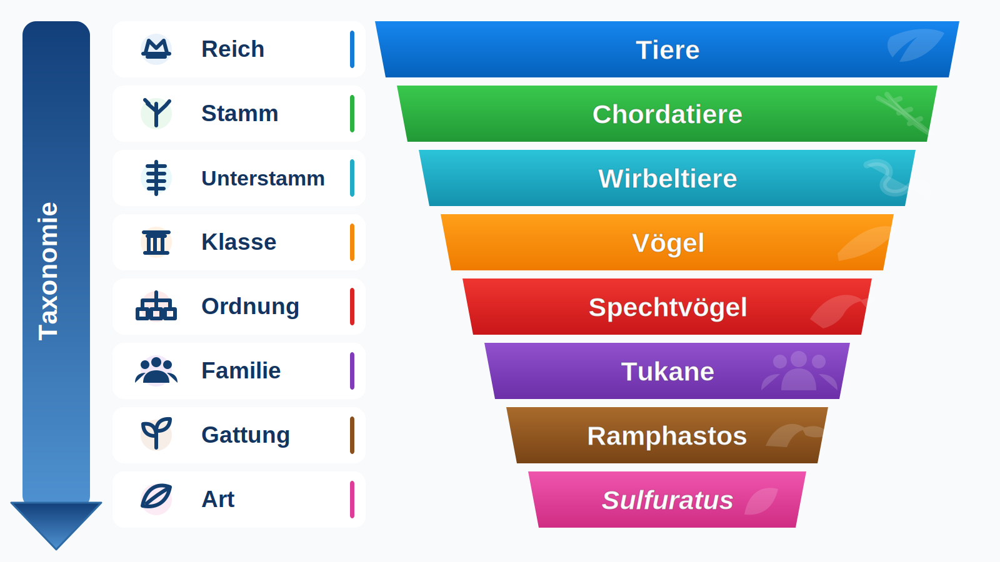

# Codex-Übergabe: Taxonomie-Pyramide modernisieren

Stand: 2026-07-18

## Ziel

Die bisherige dynamische Taxonomie-Pyramide auf den Squarespace-Artseiten soll durch eine moderne, responsive HTML-/CSS-Komponente ersetzt werden. Die beigefügte Konzeptgrafik ist die visuelle Referenz, aber **kein** fertiges Frontend-Asset.



Konzeptdatei: `docs/concepts/taxonomy-pyramid-redesign-concept.svg`

## Verbindliche Grundentscheidung

- Die Taxonomie bleibt datengetrieben und wird weiterhin durch `species-taxonomy.js` aus `speciesData.json` gerendert.
- Das Konzeptbild dient nur als Designvorgabe.
- Keine artweise erzeugten Taxonomie-PNGs oder andere statische Bildvarianten einführen.
- Die bestehende Squarespace-Container-ID `#species-taxonomy` bleibt erhalten.
- Die neue Darstellung muss ohne Änderung am vorhandenen Squarespace-Codeblock funktionieren.

## Gewünschte Hierarchie

Die Ausgabe soll bis zu acht Stufen enthalten:

| Rang | Beispielwert im Konzept |
|---|---|
| Reich | Tiere |
| Stamm | Chordatiere |
| Unterstamm | Wirbeltiere |
| Klasse | Vögel |
| Ordnung | Spechtvögel |
| Familie | Tukane |
| Gattung | Ramphastos |
| Art | Sulfuratus |

Die Beispielwerte beziehen sich auf `Ramphastos sulfuratus`. Produktiv müssen je Art die zugehörigen dynamischen Werte erscheinen.

## Sprach- und Schreibregeln

- Rangbezeichnungen links vollständig deutsch: `Reich`, `Stamm`, `Unterstamm`, `Klasse`, `Ordnung`, `Familie`, `Gattung`, `Art`.
- Werte rechts nach Möglichkeit deutsch anzeigen.
- Jeder sichtbare Wert beginnt entsprechend der freigegebenen Gestaltung mit einem Großbuchstaben.
- Technische Leerwerte wie `n/a`, leere Strings, `unknown` oder `undefined` niemals sichtbar ausgeben.
- Die Konzeptvorgabe schreibt bei der Art `Sulfuratus` mit großem Anfangsbuchstaben. Das ist eine bewusste UI-Vorgabe und weicht von der biologischen Schreibkonvention für das Artepitheton ab. Nicht eigenmächtig auf Kleinschreibung umstellen.

## Datenmodell und Unterstamm

Der aktuelle Datenbestand enthält regulär:

- `Kingdom`
- `Phylum`
- `Class`
- `Order`
- `Family`
- `Genus`
- `Species`

Ein Feld für den Unterstamm gehört derzeit nicht zum regulären Bestand. Die Prüfung der offiziellen IUCN-API-v4-
OpenAPI-Beschreibung am 2026-07-18 ergab kein dokumentiertes Feld `subphylum_name`. Der Datenadapter liest dieses
Feld trotzdem kontrolliert ein, falls IUCN es künftig oder für einzelne Datensätze ausliefert. Fehlt es, wird der
technische Leerwert `n/a` erzeugt und in der Oberfläche vollständig ausgeblendet.

### Umgesetzte Lösung

1. `scripts/iucn-data-adapter.mjs` übernimmt einen tatsächlich gelieferten Wert `taxon.subphylum_name` als
   `Subphylum`.
2. `emptyEntry()` erzeugt `Subphylum: "n/a"`; `normalizeTaxonomyFields()` und das kontrollierte
   Normalisierungsskript behandeln den Rang wie die übrigen höheren Taxonomiestufen.
3. Datenschema, Explorer-Modell und Detailansicht akzeptieren den optionalen Rang. Der Explorer zeigt ihn nur bei
   einem verwertbaren Wert.
4. Bestehende Datensätze ohne Feld bleiben gültig. Der nächste reguläre Pipeline-Lauf ergänzt den technischen
   Leerwert, solange die API keinen echten Unterstamm liefert.
5. Die lokale Squarespace-Vorschau kann `Vertebrata` ausschließlich zu Testzwecken simulieren; diese Simulation
   verändert weder `speciesData.json` noch produktive Daten.

### Kein abgeleiteter Fallback

Falls IUCN keinen echten Unterstammwert liefert, wird die Stufe für diese Art vollständig ausgeblendet. Weder `Wirbeltiere` noch ein anderer Unterstamm darf aus Klasse, Stamm oder anderen Taxonomiefeldern abgeleitet oder pauschal hartcodiert werden. Dadurch bleiben auch andere mögliche Unterstämme fachlich korrekt behandelbar.

Die Darstellung muss deshalb mit sieben oder acht Stufen stabil funktionieren. Eine fehlende Unterstamm-Zeile wird vollständig entfernt; es darf keine leere farbige Stufe entstehen.

## Deutsche Taxonomiewerte

Die wissenschaftlich eindeutigen Rohwerte sollen erhalten bleiben. Deutsche Anzeigenamen werden über eine zentrale, erweiterbare Zuordnung erzeugt und nicht durch verteilte Einzelbedingungen im DOM-Code.

Beispiel:

```js
const TAXONOMY_TRANSLATIONS = {
  Animalia: "Tiere",
  Chordata: "Chordatiere",
  Vertebrata: "Wirbeltiere",
  Aves: "Vögel",
  Piciformes: "Spechtvögel",
  Ramphastidae: "Tukane",
};
```

Nicht vorhandene Übersetzungen fallen kontrolliert auf den normalisierten wissenschaftlichen Wert zurück. Die Komponente darf wegen einer fehlenden Übersetzung nicht ausfallen.

## Visuelles Soll

Die Konzeptgrafik ist die maßgebliche optische Referenz. Der im lokalen Vorschauprozess gemeinsam präzisierte
Endentwurf besteht aus:

- links einem schlanken, anthrazit-schwarzen Pfeil mit der normal groß-/kleingeschriebenen vertikalen Beschriftung
  `Taxonomie` und einer nahtlos
  ausgeformten Spitze nach unten;
- exakt gleicher Ober- und Unterkante von Pfeil und erster beziehungsweise letzter sichtbarer Taxonomiestufe;
- einer auf Desktop und Tablet zentrierten kompakten Gesamtgruppe; nur mobil entspricht der Abstand vom Pfeil zur
  breitesten ersten Stufe dem Abstand dieser Stufe zum rechten Rahmen;
- einer vollständigen, farbigen und leicht glänzenden Stufe je Rang;
- einem generischen Rangsymbol in einem abgedunkelten Kreis, einer schmalen weißen Trennlinie sowie Rang und Wert
  innerhalb derselben Stufe;
- zentrierten, dynamisch berechneten Breiten. Der längste einzeilig benötigte Rang-/Wertinhalt bestimmt zusammen mit
  seiner Rangtiefe die Ausgangsbreite; anschließend nimmt jede Stufe um denselben Betrag ab, damit beide Außenkanten
  eine gleichmäßige diagonale Flucht bilden;
- einer leichten Trapezform je Stufe: Die Unterkante ist auf beiden Seiten um den halben Verjüngungsschritt
  eingerückt und geht dadurch bündig in die Oberkante der nächsten Stufe über;
- direkt aneinanderliegenden Stufen ohne vertikalen Zwischenraum, damit sieben und acht Ebenen kompakt bleiben;
- einer gemeinsamen typografischen Grundlinie für Rang und Wert sowie identischer Trapez-/Eckenbehandlung in allen
  drei responsiven Ansichten;
- dezenter Tiefenwirkung und kontrastreicher weißer Typografie ohne überladene 3D-Optik.

Die sichtbaren Werte werden nicht vollständig großgeschrieben. Sie beginnen mit einem Großbuchstaben und werden
danach normal geschrieben, beispielsweise `Reich: Tiere`.

Icons vorzugsweise als lokale Inline-SVGs, CSS-Masken oder einfache CSS-Formen umsetzen. Keine externen Icon-CDNs und keine neuen Drittanbieter- oder Trackingdienste einführen.

## Umsetzungsstand im Arbeitsbranch

- `species-taxonomy.js` rendert die Stufen aus einer zentralen Konfiguration, übersetzt bekannte wissenschaftliche
  Werte zentral ins Deutsche und fällt bei unbekannten Werten auf den normalisierten Rohwert zurück.
- Die Ausgabe verwendet semantische Listelemente, echte Texte und dekorative Inline-SVGs ohne externe Abhängigkeit.
- Die generischen Rangicons bleiben unabhängig von Tiergruppe und Art verständlich. Für `Klasse` wird deshalb ein
  neutrales Ebenen-/Schichten-Symbol statt eines Vogel-, Säugetier- oder Fischsymbols verwendet.
- Die CSS-Ausgabe ist für drei Spalten auf großen Desktops, eine lesbare einspaltige Tabletansicht sowie Mobilbreiten
  bis 320 Pixel geprüft. Sieben und acht Stufen erzeugen keine horizontale Seitenscrollleiste; der Pfeil endet in
  beiden Fällen exakt mit der letzten Stufe.
- Automatisierte Tests decken sieben Stufen, einen echten Unterstamm, technische Leerwerte, unbekannte
  Übersetzungen, HTML-Escaping und Adapter-/Schemaschnittstellen ab.
- Felix hat den lokalen Endentwurf am 2026-07-18 in Desktop-, Tablet- und Mobilbreite visuell freigegeben. Der
  freigegebene Stand wurde nach `main` übernommen und der erste Pages-Lauf war erfolgreich. Das Modul lädt das
  zugehörige Taxonomie-CSS vor dem Rendern aus demselben Pages-Artefakt, damit Markup und Gestaltung künftig atomar
  veröffentlicht werden. Die dokumentierte produktive Cache-Version ist `species-taxonomy.js?v=1.0.4`.

## Betroffene Dateien

- `species-taxonomy.js`
- `update.mjs`, falls `Subphylum` in das Datenmodell aufgenommen wird
- `speciesData.json`, nur als kontrolliertes Pipeline- oder Migrationsergebnis
- `docs/squarespace-custom.css`
- `docs/squarespace-footer.html`, falls die Version von `species-taxonomy.js` erhöht wird
- `README.md`
- `AGENTS.md`
- `docs/roadmap.md`
- dieses Dokument

## JavaScript-Anforderungen

- Bestehendes `escapeHtml()` beibehalten oder gleichwertig absichern.
- Stufen aus einer Datenstruktur erzeugen, nicht acht fast identische HTML-Zeilen fest verdrahten.
- Nur Stufen mit verwertbarem Wert rendern.
- Die Breitenmessung ermittelt den tatsächlichen einzeiligen Platzbedarf jeder Stufe. Aus dem größten Bedarf
  einschließlich Rangtiefe wird die Ausgangsbreite berechnet; alle Folgestufen erhalten denselben Verjüngungsschritt.
- Größenänderungen werden mit einem lokalen `ResizeObserver` nachgeführt; ein globaler Resize-Listener dient nur als
  Fallback für Browser ohne `ResizeObserver`.
- Keine globalen Variablen außerhalb des bestehenden Modulrahmens einführen.

Empfohlene Struktur:

```js
const levels = [
  { key: "Kingdom", rank: "Reich", className: "kingdom", icon: "globe" },
  { key: "Phylum", rank: "Stamm", className: "phylum", icon: "branch" },
  { key: "Subphylum", rank: "Unterstamm", className: "subphylum", icon: "spine" },
  { key: "Class", rank: "Klasse", className: "class", icon: "layers" },
  { key: "Order", rank: "Ordnung", className: "order", icon: "hierarchy" },
  { key: "Family", rank: "Familie", className: "family", icon: "group" },
  { key: "Genus", rank: "Gattung", className: "genus", icon: "sprout" },
  { key: "Species", rank: "Art", className: "species", icon: "leaf" },
];
```

## CSS-Anforderungen

- Produktive CSS-Referenz bleibt `docs/squarespace-custom.css`.
- Alle Klassen unter `#species-taxonomy` beziehungsweise einem eindeutigen Modul-Root scopen.
- Keine ungescopten generischen Klassen wie `.row`, `.icon` oder `.label` verwenden.
- Desktop und Mobilansicht getrennt prüfen.
- Der Rahmen muss weiterhin mit der bestehenden Modulspalte in `#species-output` harmonieren.
- Die Darstellung darf Info- und Statusspalte nicht unkontrolliert verbreitern.

## Responsives Verhalten

### Desktop

- Zwei klar erkennbare Bereiche: der vertikale Taxonomiepfeil und die einheitlichen farbigen Rang-/Wertstufen.
- Die kompakte Gesamtgruppe aus Pfeil und Stufen ist im Taxonomierahmen horizontal zentriert.
- Alle acht Stufen innerhalb des vorhandenen Taxonomie-Rahmens lesbar.
- Keine abgeschnittenen Texte und keine horizontale Überlappung.

### Tablet

- Zwischen 769 und 1100 Pixeln werden allgemeine Daten, Taxonomie und IUCN-Daten untereinander angeordnet.
- Der Taxonomierahmen nutzt dieselbe volle Breite wie allgemeine Daten und IUCN-Daten. Die darin zentrierte
  Pfeil-/Stufengruppe bleibt anhand des längsten einzeiligen Inhalts so kompakt wie möglich.
- Desktop und Tablet verwenden denselben dezenten Verjüngungsschritt von zehn Pixeln und dieselbe weiche Rundung,
  damit die Tabletstaffel optisch der freigegebenen Desktopdarstellung entspricht.
- Die Tabletansicht erzeugt keine horizontale Seitenscrollleiste.

### Mobil

- Innerhalb der vorhandenen einspaltigen Mobilansicht funktionieren.
- Pfeil und Rangspalte dürfen schmaler werden.
- Nur mobil nutzt die erste Stufe die gesamte verfügbare Restbreite; ihr Abstand zum Pfeil entspricht dem Abstand
  zum rechten Rahmen. Aus den einzeiligen Platzbedarfen aller Folgestufen wird der größtmögliche gemeinsame
  Verjüngungsschritt bis maximal zehn Pixel berechnet. Falls selbst vier Pixel nicht ohne Platzmangel möglich sind,
  wird kontrolliert umgebrochen statt Inhalt abzuschneiden.
- Lange Werte dürfen die Komponente nicht sprengen. Bevorzugt Schriftgröße mit `clamp()` reduzieren; nur falls erforderlich kontrolliert umbrechen.
- Keine horizontale Seitenscrollleiste erzeugen.

## Barrierefreiheit

- Taxonomiewerte bleiben als echter Text im DOM.
- Dekorative Icons mit `aria-hidden="true"` kennzeichnen.
- Sinnvolle Gruppenstruktur verwenden, beispielsweise Liste oder `role="list"` und `role="listitem"`.
- Farbkontrast der weißen Schrift gegen jede Stufenfarbe prüfen.
- Die visuelle Pfeilrichtung darf nicht die einzige semantische Information sein.

## Test- und Abnahmeplan

Mindestens prüfen:

1. Syntax:
   - `node --check species-taxonomy.js`
   - bei Pipeline-Änderung `node --check update.mjs`
   - `npm.cmd run --silent test:taxonomy`
   - `npm.cmd run --silent test:providers`
   - `npm.cmd run --silent test:explorer-model`
2. Datenfälle:
   - Art mit acht vollständigen Stufen;
   - Art ohne Unterstamm;
   - fehlende deutsche Übersetzung;
   - technischer Leerwert beziehungsweise `n/a`;
   - sehr langer Familien-, Gattungs- oder Artname.
3. Layout:
   - lokale Squarespace-nahe Vorschau mit `npm.cmd run --silent preview:squarespace` starten;
   - Desktop in der bestehenden Drei-Spalten-Artseite;
   - Tablet;
   - Smartphone unter 768 Pixel;
   - keine horizontale Scrollleiste;
   - Pfeilhöhe und Zeilenausrichtung stimmen.
4. Live-Pfad nach Deployment, beispielsweise:
   - `/wildlife/heimische-tierwelt/acanthisflammea`
   - eine Costa-Rica-Art, insbesondere Fischertukan, falls aktiv.
5. Cache und Versionierung:
   - Umsetzung ausschließlich im Phase-8-Arbeitsbranch;
   - lokale Vorschau und anschließend nicht öffentlich verlinkte Squarespace-Testseite abnehmen;
   - ausdrückliche Freigabe durch Felix abwarten;
   - erst danach nach `main` übernehmen;
   - GitHub-Pages-Deployment abwarten;
   - erst danach `species-taxonomy.js?v=...` in Squarespace beziehungsweise `docs/squarespace-footer.html` erhöhen;
   - Live-Seite erneut prüfen.

Der verbindliche Ablauf und die Rückfallregel stehen in `docs/phase-8-preview-release.md`. Ohne ausdrückliche
Freigabe bleibt der produktive Squarespace-Footer unverändert.

## Akzeptanzkriterien

Die Aufgabe ist abgeschlossen, wenn:

- die alte Taxonomie-Pyramide durch die neue dynamische Komponente ersetzt ist;
- alle sichtbaren Rangbezeichnungen deutsch sind;
- deutsche Werte verwendet werden, sofern eine zentrale Übersetzung vorhanden ist;
- `Unterstamm` ausschließlich aus einem tatsächlich vorhandenen Datenwert eingebunden und andernfalls vollständig ausgeblendet ist;
- sieben und acht Stufen ohne Leerzeile funktionieren;
- die Komponente auf Desktop und Mobil ohne Überlauf lesbar ist;
- kein statisches Taxonomie-Bild als funktionaler Ersatz eingebaut wurde;
- GitHub Pages und Squarespace live geprüft wurden;
- `README.md`, `AGENTS.md`, `docs/roadmap.md`, `docs/squarespace-custom.css` und gegebenenfalls `docs/squarespace-footer.html` auf den echten Endstand gebracht wurden.

## Nicht Teil dieser Aufgabe

- Andere Module optisch neu gestalten.
- Taxonomie im Arten-Explorer bearbeitbar machen.
- Externe Iconbibliotheken oder neue Drittanbieterdienste einführen.
- Wissenschaftliche Rohwerte durch ausschließlich deutsche Werte ersetzen.
